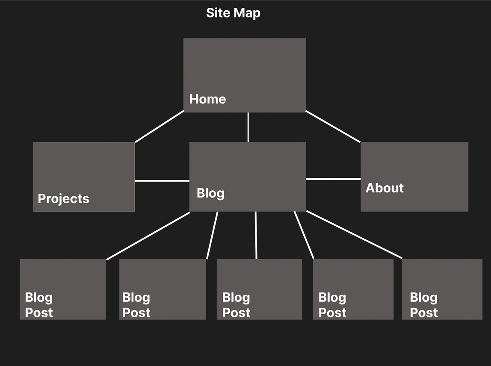
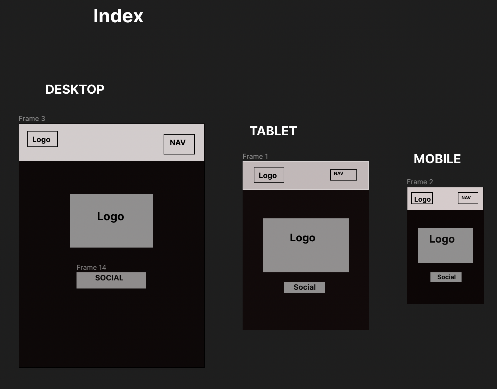
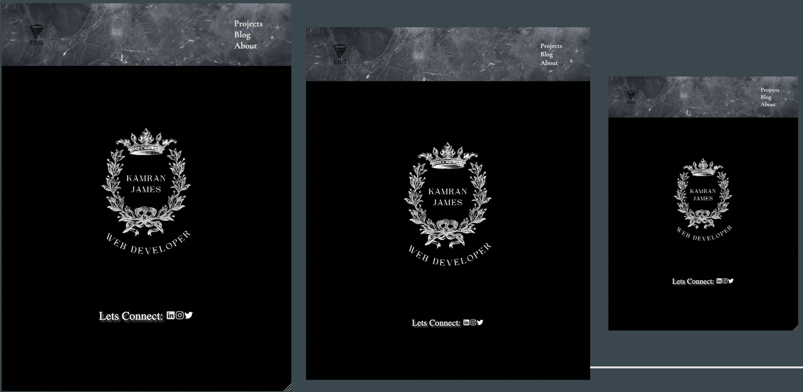
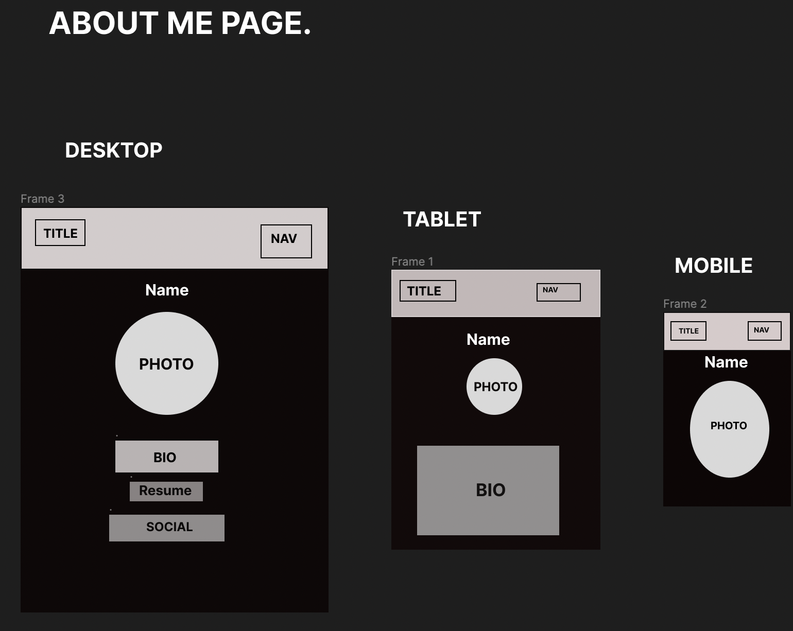
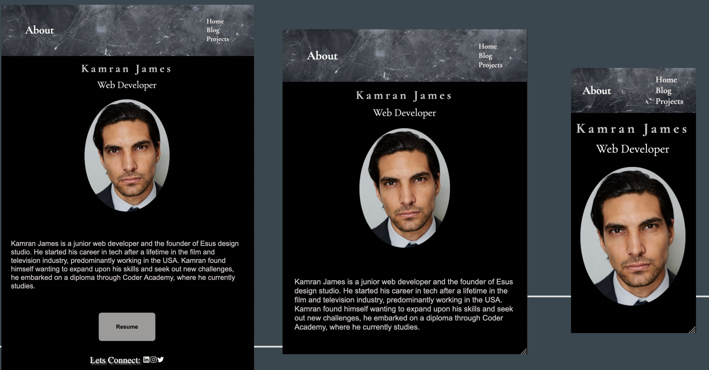
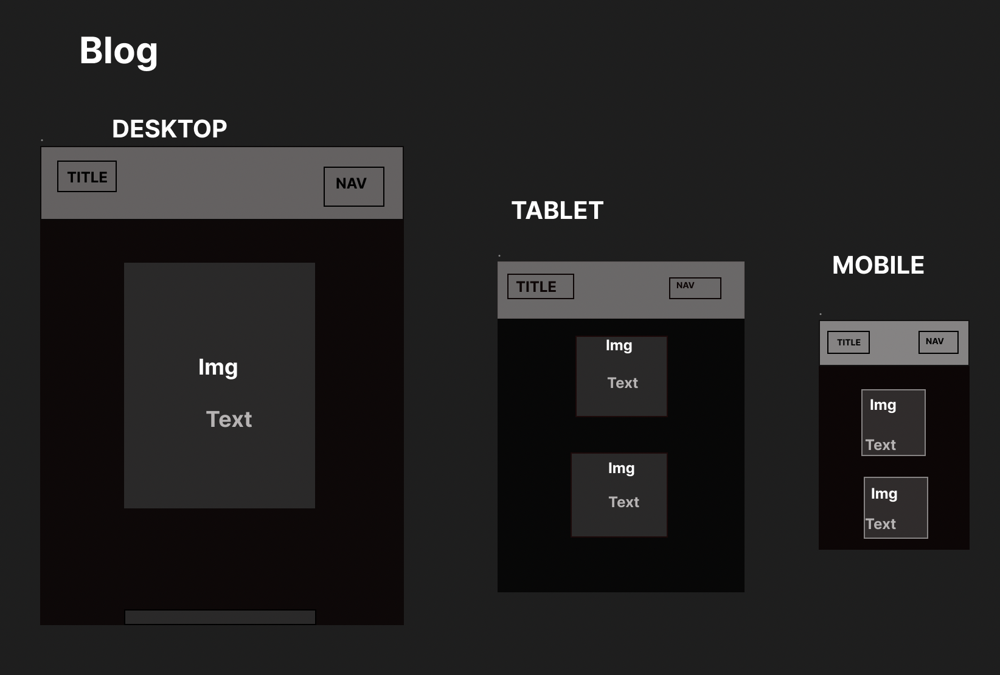
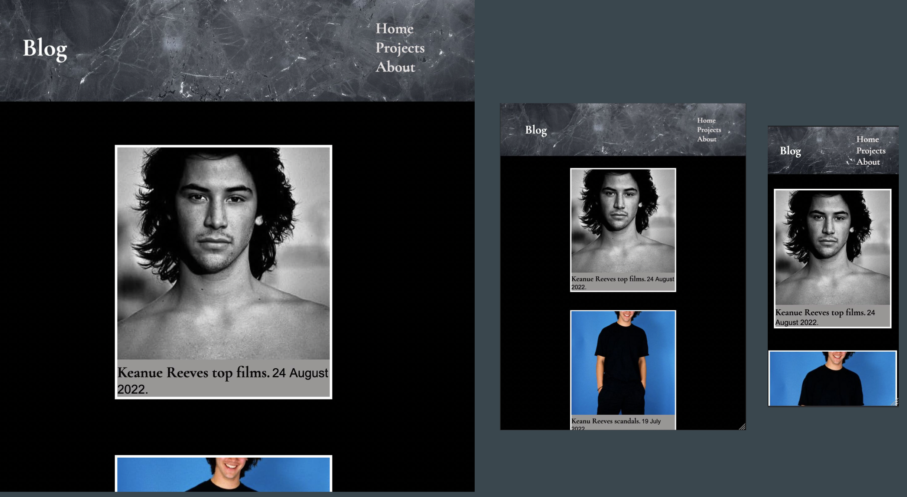
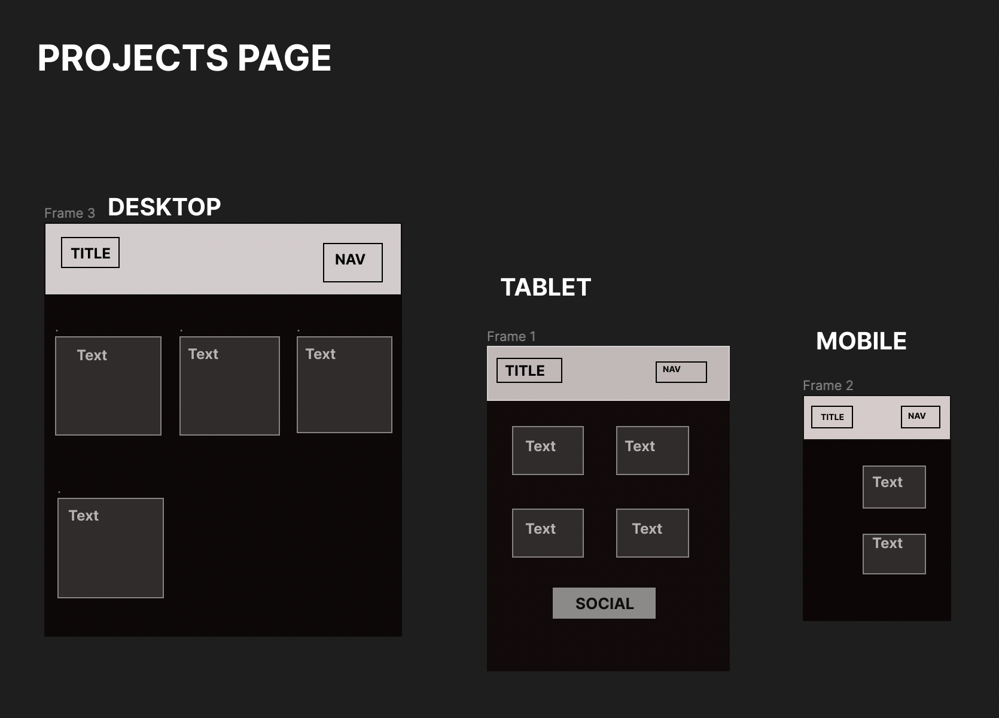
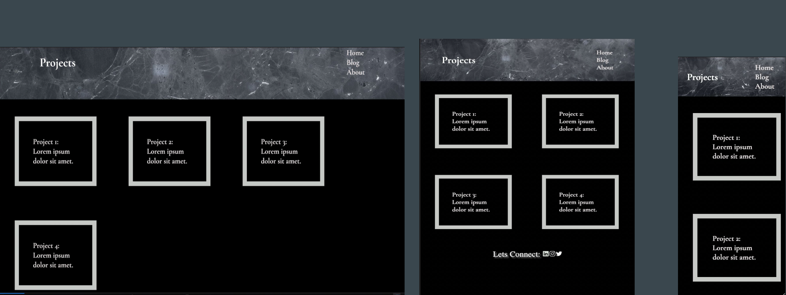
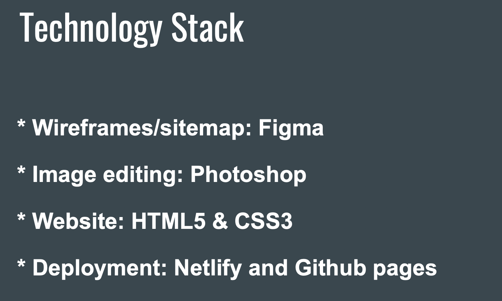

## T1A2 Portfolio Website - By Kamran James Ozturk

Portfolio Website: [Portfolio](https://github.com/KamranJames/Portfolio.git)

Github repo located here: [Github repo](https://github.com/KamranJames/Portfolio.git)

Presentation located here: [Presentation](https://vimeo.com/manage/videos/743638342/0479fe3a66/customize)

## Purpose and Target Audience
Purpose and Target Audience
This portfolio was constructed with the intent to showcase my design process and skills in web development to potential employers in the field.
Through their interaction with my website they can gain an understanding of who I am and how I approach the design process. 

###Functionality/features
I wanted to convey my personality and ethos to the viewer through the process of design. Through this lens I found it was best to focus on classic and functional design. I actioned this through such things as: 
* A simple classic navigation bar that would navigate my website with ease across all pages.
* Responsive design that would scale with the three most common viewports across all pages.
* Social media links at the bottom of each page, that leads to social networking sites.
* *A branded logo that would display near the viewers web browser across all pages.
* A consistent design and user experience throughout the website.
* A semantic approach to programming.

There are four web pages which can all navigate between one another.

**Index/home**: This page conveys my creative aesthetic and design principles with its ease of use and simplicity. In it can be found my name, my design company logo a link to my social media platforms and a navigation bar.  

**about**: This page contains an image of me accompanied by a biography detailing my journey, my current studies, previous work history, interests as well as a resume accessible through a button.  
Projects: A projects page with four placeholder example posts, that become modular with the adjustment of the viewers screen showcasing some flex box.

**Blogs**: A blog page with access to five blog posts accessible through interactive links.

Created with figna

#### **Wireframes & Screenshots**

